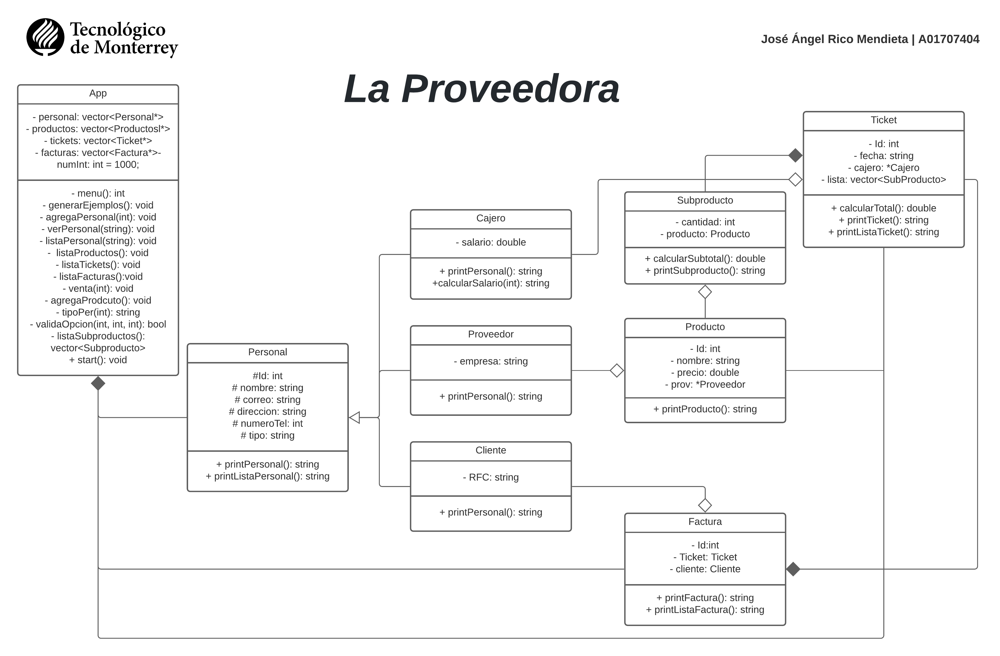

# **La Proveedora**

#### **_Programación orientada a objetos - TC1030.1_**
_Sistema diseñado para la administración de un comercio dedicado a la venta de utensilios para la cocina, entre otros._

## **Logica inicial** ⚙️ 
_Teniendo un apartado de cajero, proveedores y clientes, que conforman las personas que interactúan con el comercio, por otro lado, en una factura solo puede haber un ticket, pero puede haber varios tickets que no pertenezcan a una factura. La factura debe de referenciar a un solo cliente con sus respectivos datos, mientras que el ticket debe contener la lista de productos y solo un cajero, el que atendió; cliente puede tener varias facturas, pero una factura no puede tener más de un cliente. Por último, cada producto debe estar referenciado solo con un respectivo proveedor._

## **Diagrama UML clases**

  

## **Notas** 📌
_Se encuentra en proceso este proyecto, esto es un avance donde se plantea el ULM de todo el proyecto, aunque es probable que se implementen nuevas funcionalidades que se verán reflejados en avances posteriores._

## **Lenguaje** 👅
*  *C++*

## **Autor** ✒️
_Este proyecto es realizado para la UF "Pensamiento Computacional para Orientado a Objetos" (TC1033.2) por :_
* **José Ángel Rico Mendieta** - *A01707404*
